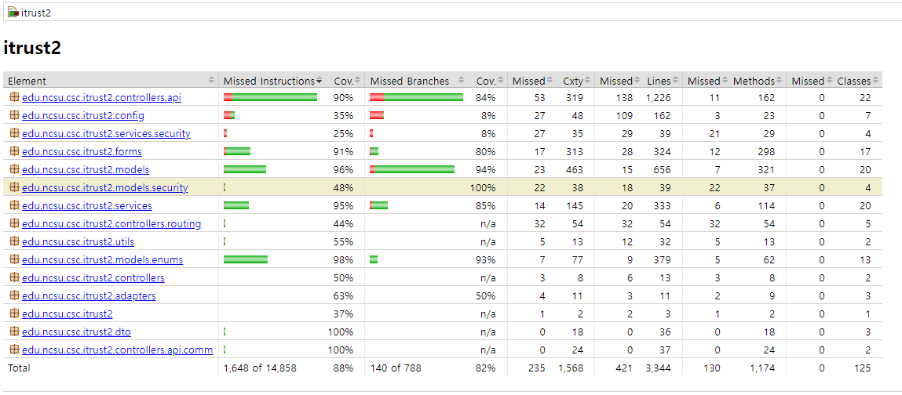

# iTrust 2

Welcome to the repository of [**Team 4**](docs/team.md)'s project for the CSI-3106 Software Engineering course at Yonsei University.

## Jacoco Coverage (last update: 11/28)

## Introduction

## Project Structure

## Prerequisites

Before starting, ensure you have the following installed:

- **JDK 17**: We recommend using [Corretto JDK 17](https://docs.aws.amazon.com/corretto/latest/corretto-17-ug/downloads-list.html) for consistency with our project setup.
- **Docker and Docker Compose**: (Optional) These are needed for setting up the local development environment.

## Installation and Usage

Follow these steps to get started:

1. **Clone the Project**:
   Use Git to clone the project repository to your local machine.

   ```bash
   git clone <project git url>
   ```

2. **Navigate to the Project Directory**:
   Change to the project's root directory.

   ```bash
   cd itrust2
   ```

3. **Configure Application Settings**:
   Place the `application.yml` file in the `src/main/resources` directory. You can either use your own configuration or our provided `application.yml` file for local Docker MySQL server setup.

4. **Start the Database**:
   Use Docker Compose to start the MySQL database server.

   ```bash
   docker compose up -d
   ```

   Or you can use your own MySQL server. Make sure to update the `application.yml` file accordingly.

5. **Start the Application**:
   Use the Gradle wrapper to run the application. For Windows, use `gradlew.bat` instead of `./gradlew`.

   ```bash
   ./gradlew bootRun
   ```

6. **Access the Web Interface**:
   Open your browser and visit `http://localhost:8080/iTrust2` to view the application.

## Quality Assurance

To run the style check and unit tests, use the Gradle wrapper.

- **Style Check**: This will run the [Spotless](https://github.com/diffplug/spotless) using the [Google Java Style Guide](https://google.github.io/styleguide/javaguide.html).

  ```bash
  ./gradlew check
  ```

- **Unit Tests**: This will run the unit tests using JUnit 4.

  ```bash
  ./gradlew test
  ```
- **Jacoco Report Creation**: This will run and create jacoco report
   - Note: change `build.gradle.kts` file to change report type or coverage limit
      - default: `build/reports/jacoco/test/html/index.html`
  ```bash
  ./gradlew testCoverage
  ```
## Team Operation and Collaboration

- **Iteration Phases**: The project is divided into three iterations - from iteration 1 to 3.
- **Team Structure**: We have organized into three teams, each responsible for two use cases.
- **Documentation**: For detailed team information, refer to [team.md](docs/team.md). Our team meeting logs are available at [meetings.md](docs/meetings.md).

## Contributing

For the cooperation rules, please review our [collaboration guidelines](CONTRIBUTING.md) for details on how to participate.

## License

This project is licensed under the [Eclipse Public License v2.0](LICENSE.md). Check the link for more details.
